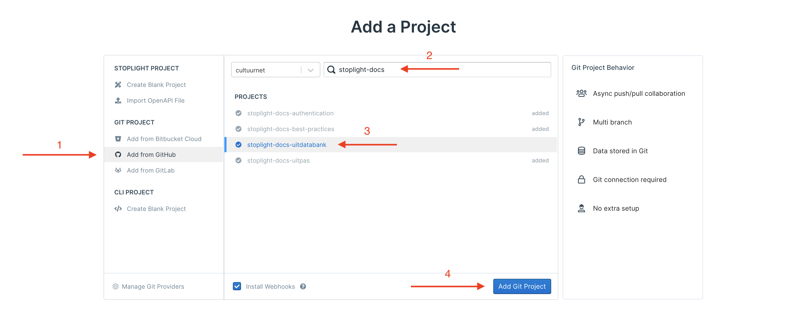

# Creating a Stoplight project

#### Step 1: Create a GitHub repository

1. Use a name that starts with `stoplight-docs-...`
2. Add a clear description
3. Make sure to make the repository **public**, otherwise assets like images won't be accessible

#### Step 2: Create your project on Stoplight

1. Select `Add from GitHub`
2. Search by `stoplight-docs-`
3. Select your repository created in the previous step
4. Add your project to Stoplight

#### Step 3: Configure the project basics

In your Stoplight project's settings, the Project Basics will be prefilled with info based on your GitHub repository. However this should be cleaned up:

1. Change the name to the product's real name instead of the name of the git repository
2. Change the slug to the product's real name instead of the name of the git repository
3. Change the tagline to a shorter description that speaks to integrators/developers (this will appear in the menu with all projects)
4. Change the randomly pre-selected icon to something that's more relevant. (See 5)
5. If you want you can click on "pick a FoneAwesome icon" to go to a list of possible icons
6. Change the icon color to the brand color of the product

#### Step 4: Manage project access

In your Stoplight project's settings, adjust the access.

1. Make sure to change the visibility from Private to something else if needed. A good initial visibility can be Internal, before the documentation is ready to go public.
2. Make sure to Save your new visibility
3. Add extra members to the project. By default only you will be able to make changes to it.