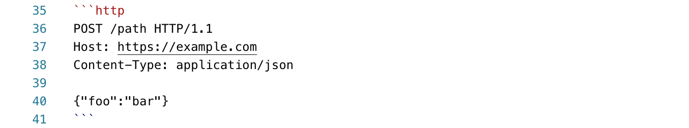
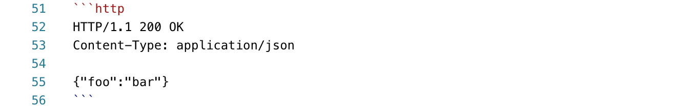
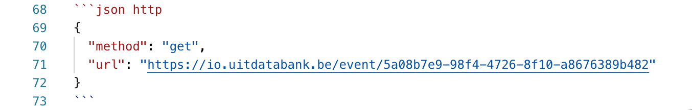

# HTTP examples

To document example HTTP requests or responses in Markdown files, use the [HTTP message format](https://developer.mozilla.org/en-US/docs/Web/HTTP/Messages) instead of `curl` examples.

`curl` examples are great for copy-pasting to try something out quickly in a terminal, but are hard to read if you want to do the HTTP request in another tool or programming language.

Instead to make the example easy to try out, you can include a "try it" block using the [HTTP request maker functionality](https://meta.stoplight.io/docs/studio/docs/Documentation/03a-stoplight-flavored-markdown.md#http-request-maker) provided by Stoplight.

This will make it easy to perform the request from the page the visitor is on, or copy-paste code to perform a HTTP request in a programming language of their choice (including `curl`).

To get the syntax highlighting of your codeblock right, make sure to specify that your codeblock is using the `http` format after the initial backticks.

### GET example (no body)

The following codeblock in the Stoplight editor


becomes 👇

```http
GET /path HTTP/1.1
Host: https://example.com
Accept: application/json
```

### POST example (with body)

The following codeblock in the Stoplight editor



becomes 👇

```http
POST /path HTTP/1.1
Host: https://example.com
Content-Type: application/json

{"foo":"bar"}
```

### Response example

The following codeblock in the Stoplight editor



becomes 👇

```http
HTTP/1.1 200 OK
Content-Type: application/json

{"foo":"bar"}
```

### Try it out functionality

The HTTP request maker functionality is documented [in Stoplight's own documentation](https://meta.stoplight.io/docs/studio/docs/Documentation/03a-stoplight-flavored-markdown.md#http-request-maker).

For example, to demonstrate how to retrieve an event from UiTdatabank:



becomes 👇

```json http
{
  "method": "get",
  "url": "https://io.uitdatabank.be/event/5a08b7e9-98f4-4726-8f10-a8676389b482"
}
```