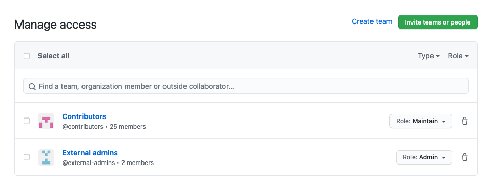
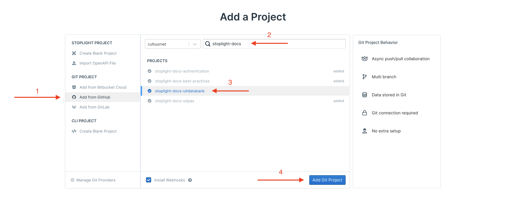
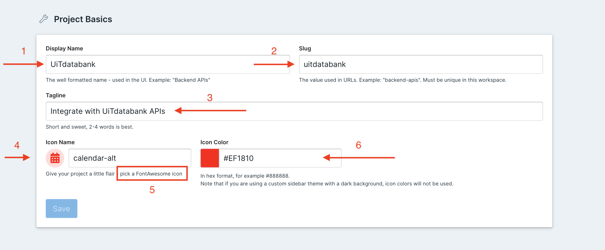
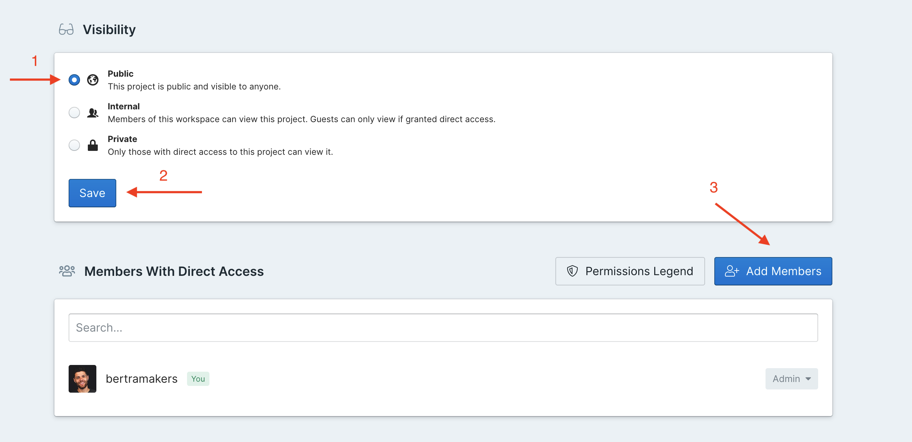

# Creating a Stoplight project

## Step 1

Create a GitHub repository inside the cultuurnet organization.

1.  Use a name that starts with `stoplight-docs-...`
2.  Add a clear description
3.  Make sure to make the repository **public**, otherwise assets like images won't be accessible

**Also remember to give the *contributors* and *external admins* groups access to the repository!**

## Step 2

Setup the CI for the new repository.

Run the [configure-ci.sh script](https://github.com/cultuurnet/stoplight-ci#configure-cish) provided on GitHub inside a local clone of your newly created repository. This will automatically add a README, install the necessary packages for linting, configuration files for the linting tools, configuration for GitHub Actions, a pull request template, etc.

Make sure to commit and push the resulting changes afterward!

> You will need npm 7+ and yarn to run the configure-ci.sh script

## Step 3

Make PRs required to make changes.

Make `master` a [protected branch](https://docs.github.com/en/github/administering-a-repository/defining-the-mergeability-of-pull-requests/about-protected-branches) inside your new GitHub repository, with the following settings:

- [x] Require pull request reviews before merging
- [x] Require status checks to pass before merging
- [x] Require branches to be up to date before merging 
- [x] Include administrators
- [x] Restrict who can push to matching branches (*don't list any people*)

Additionally, in the main Options of your repository, check the following options:

- [x] Automatically delete head branches

## Step 4

Create your project on Stoplight.

1.  Select `Add from GitHub`
2.  Search by `stoplight-docs-`
3.  Select your repository created in the previous step
4.  Add your project to Stoplight

## Step 5

Click the cog button (settings) in your project sidebar and configure the following settings:

1.  Change the name to the product's real name instead of the name of the git repository
2.  Change the slug to the product's real name instead of the name of the git repository
3.  Change the tagline to a shorter description that speaks to integrators/developers (this will appear in the menu with all projects)
4.  Change the randomly pre-selected icon to something that's more relevant. (See 5)
5.  If you want you can click on "pick a FoneAwesome icon" to go to a list of possible icons
6.  Change the icon color to the brand color of the product

## Step 6

Click the Share button in the sidebar of your project and configure your project's access:

In your Stoplight project's settings, adjust the access.

1.  Add extra members to the project. By default only you will be able to make changes to it.
2.  Optionally you can change the visibility to Internal or Public. However a new project should start as Private and only change visibility once it's ready.
